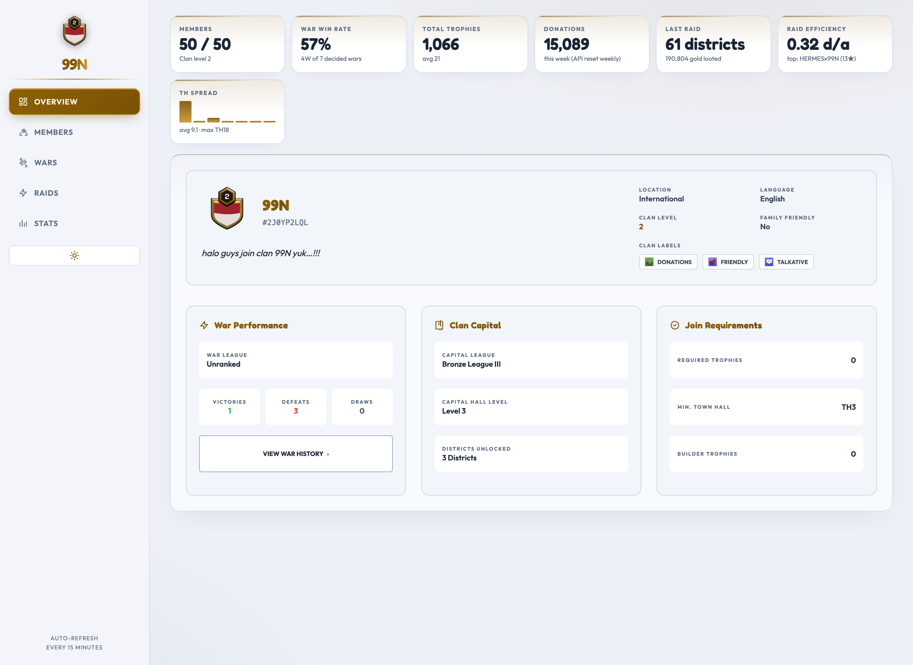
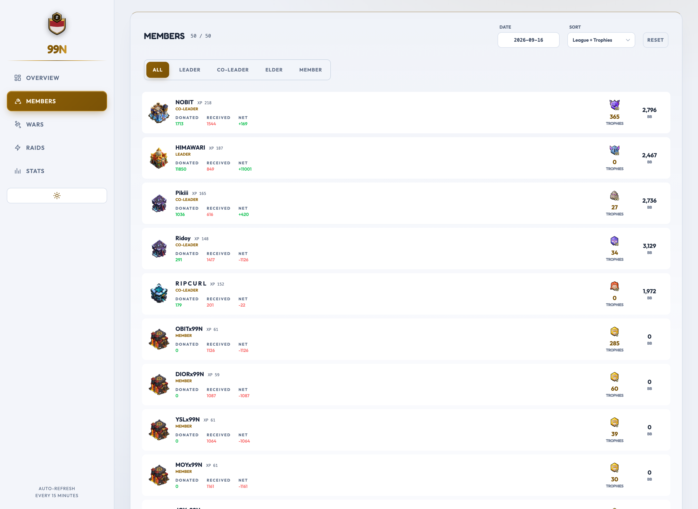
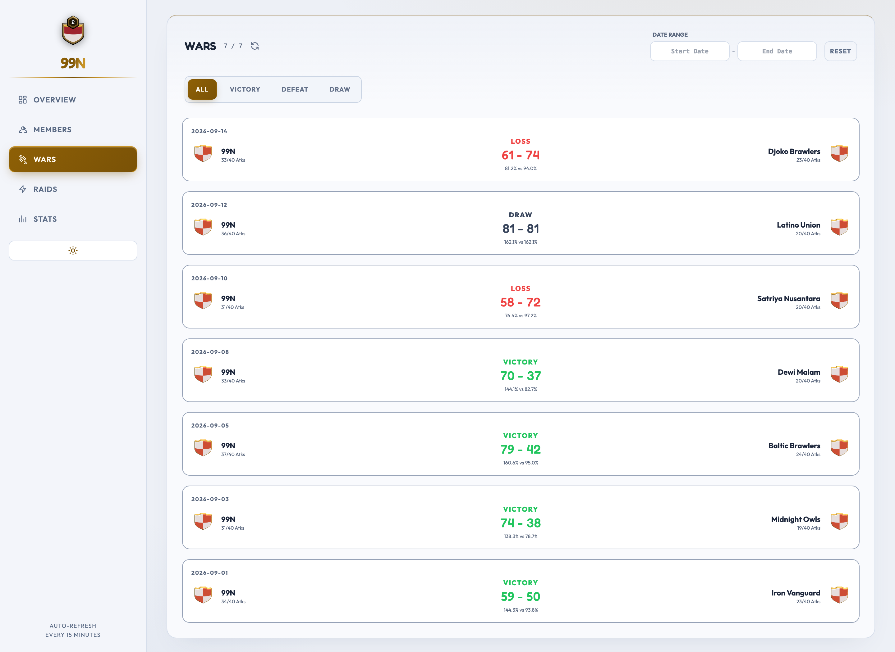
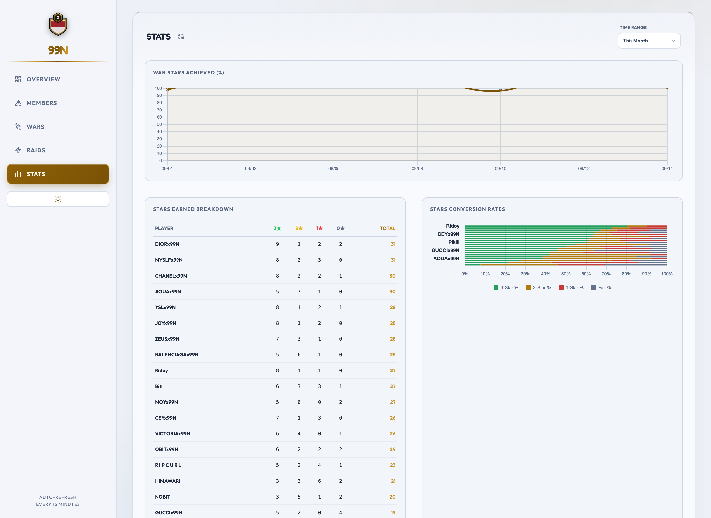

# 99N — Clan War Stats

Clash of Clans clan dashboard for **99N (#2J0YP2LQL)**. A Python scraper runs on GitHub Actions, commits JSON snapshots to this repo, and the static frontend (GitHub Pages) renders them — no backend needed.

## Tabs

| Tab | What it shows | Data source |
|---|---|---|
| Overview | KPI strip + clan card, war/capital league, join requirements | latest member snapshot + indices |
| Members | Roster with donations, trophies, role filters, **any historical date** | daily snapshots |
| Wars | War list + per-player attack/defense breakdown, win probability, cleanup needed | war snapshots |
| Raids | Capital raid weekends: attacks, defenses, loot per player | raid logs |
| Stats | Stars-trend line, top-25 star breakdown, conversion-rate bars (finished wars only), **raid attendance** | war + raid snapshots |

## Screenshots (War Room, night theme)

| Overview — KPI strip + clan card | Members — roster with Net & Builder Base |
|---|---|
|  |  |
| **Wars — history & results** | **Stats — trend & conversion** |
|  |  |

> War screenshots use a synthetic war-history fixture (the archive was empty
> when they were captured) — the real site fills from actual 99N wars.

## How it works

```
Supercell API ──(proxy)──► GitHub Actions (cron) ──► commit JSON to data/ ──► Pages serves js/ + data/
```

The browser never calls the API — it only reads committed JSON. That's why the API token lives solely in Actions secrets.

### Data layout

```
data/
  clan_stats/members_YYYYMMDD.json   + clan_stats_index.json   # daily roster
  war_stats/war_<startTime>.json     + war_stats_index.json    # live war, finalised on warEnded
  raid_stats/raid_<startTime>.json   + raid_stats_index.json   # per raid weekend
  warlog_stats/warlog.json                                      # last 50 results (no attacks)
  player_stats/players_YYYYMMDD.json + player_stats_index.json  # career stats per member
  meta.json                                                     # goldpass / country rank / CWL
  notify_state.json                                             # last-seen state for Discord alerts
```

**War history starts from the day you install this** — the CoC API only exposes full per-player attack data on the `currentwar` endpoint while a war is live; `warlog` has results but no attacks, so older wars cannot be backfilled (they still appear in the list, marked *summary only*).

## Discord notifications

Two ways to reach the clan Discord, both driven by one secret:

```bash
# .env (local) or Settings -> Secrets -> Actions (repo)
DISCORD_WEBHOOK_URL=https://discord.com/api/webhooks/<id>/<token>
```

**Automatic** — `scrapers/notify.py` runs after each scrape and posts only on a
state *change* (state lives in `data/notify_state.json`, so restarts never spam):

| Event | Trigger | Embed |
|---|---|---|
| War preparation | new war enters `preparation` | opponent, size, battle-day time |
| War result | snapshot flips to `warEnded` | VICTORY/DEFEAT/DRAW, stars, destruction |
| Raid start / finish | raid weekend opens or closes | loot, districts, top looters |
| Roster change | a tag appears or disappears | who joined/left + new count |
| Donation week | weekly counters reset | last week's total + early leaders |

The step is `continue-on-error: true`: a missing webhook or a Discord outage
never fails the data pipeline. Test locally without sending anything:

```bash
PYTHONPATH=scrapers python3 scrapers/notify.py --event war --dry-run
```

**Manual** — the dashboard's **Broadcast** tab composes a message (title,
colour, templates) and shows the exact JSON payload. Two caveats, both by
design: the built-in Send button only works when you serve the site locally
(Discord blocks the cross-origin POST from `fthyll.github.io`), and the webhook
URL is never stored in the repo — it lives in `.env`/Actions secrets, and the
tab keeps a URL you type in `sessionStorage` only. The equivalent CLI:

```bash
PYTHONPATH=scrapers python3 scrapers/broadcast.py --text "War jam 20:00!" --title "War Reminder" --color gold
```

## Theme system

The UI ("War Room") is one palette contract with two value sets, selected by `<html data-theme="night|day">`:

- Every color is a CSS custom property in `css/style.css` (night = navy onyx + Clash gold, day = cool paper + bronze). Token *names* are stable; only values swap, so no `dark:` variants exist anywhere in the markup.
- Tailwind utilities (`text-gold`, `bg-gray-800`, even `text-white`) resolve to those vars through `tailwind.config` in `index.html`; Chart.js resolves them at draw time via `chartTheme()` in `js/charts.js` and re-renders when you toggle.
- The toggle (sidebar/top bar) persists to `localStorage.coc-theme`; a boot script in `<head>` applies the stored theme — or the OS `prefers-color-scheme` — before first paint, so there is no flash.
- Contrast is WCAG-checked per theme (≥4.5:1 for all text pairs).

**Layout**: 236px sticky sidebar ≥1024px, collapsing to a scrollable top bar on mobile. The Overview KPI strip (`renderKpis` in `js/app.js`) is derived entirely from data the app already fetched — nothing extra hits the network; the win-rate card is governed by the same `warEnded` guard as the Wars tab.

## Setup

### 1. API token

Register at [developer.clashofclans.com](https://developer.clashofclans.com) and create a key. One key = one allowed IP:

| Where scrapers run | Base URL | IP to **include** when creating the key |
|---|---|---|
| GitHub Actions | `https://cocproxy.royaleapi.dev/v1` (default) | `45.79.218.79` (the RoyaleAPI proxy) |
| Your laptop | `COC_API_BASE_URL=https://api.clashofclans.com/v1` | your own IP ([ifconfig.me](https://ifconfig.me)) |

These can be two separate keys; the proxy key is only for Actions.

### 2. GitHub secrets

Settings → Secrets and variables → Actions:

- `COC_API_TOKEN` — the proxy-whitelisted key
- `CLAN_TAG` — e.g. `#2J0YP2LQL`

### 3. Permissions & Pages

- Settings → Actions → General → Workflow permissions → **Read and write** (the bots commit back).
- Settings → Pages → Deploy from a branch → `main`, root folder. This repo is public, so Pages is free; a private repo needs GitHub Premium, or a separate public repo for the rendered site (never commit `.env` or tokens there).
- Live here: https://fthyll.github.io/99N/
- `CNAME` (optional): put your own domain there and point DNS at GitHub Pages.

### 4. Automation

| Workflow | Schedule | What |
|---|---|---|
| `update_war.yml` | every 15 min | live war snapshots; finalises each war once |
| `update_raid.yml` | every 15 min | current raid weekend; new file each weekend |
| `update_clan.yml` | daily 09:00 UTC | roster snapshot for the Members history |
| `tests.yml` | on push / PR | Node + Python suites, HTML structure check |
| `health.yml` | every 2 h | alerts if snapshots or scheduled runs go stale |

Manual trigger: Actions tab → *Run workflow*.

### Local run (optional)

```bash
cd scrapers && pip install requests python-dotenv
cp ../.env.example ../.env   # fill COC_API_TOKEN, CLAN_TAG (+COC_API_BASE_URL)
PYTHONPATH=$PWD python3 ../scrapers/clan_scraper.py
```

Files land in `scrapers/data/` when run from that directory — run them from the repo root (like the workflows do) to write `data/` directly.

## Tests

No dependencies beyond Node and Python; run from the repo root:

```bash
node js/xss.test.mjs            # 24 checks: weaponised names render inert in every view
node js/warstate.test.mjs       # only warEnded wars get a Victory/Loss/Draw label
node js/importsmoke.test.mjs    # all modules parse without a DOM
node js/notifier.test.mjs       # embed shapes + state transitions
python3 scrapers/war_scraper_test.py    # 9 scenarios against a stubbed HTTP layer
python3 scrapers/http_client_test.py    # retry/backoff on 429 and 5xx
python3 scrapers/retention_test.py      # pruning never orphans an index entry
python3 scripts/check_html.py            # index.html <div> balance + section nesting
```

The Python tests need `COC_API_TOKEN` and `CLAN_TAG` set to *any* value —
`config.py` refuses to import without them. No request is ever made.

All of the above run in CI on every push and PR (`.github/workflows/tests.yml`),
plus a check that `index.html` has balanced `<div>`s and keeps every
`[id^="section-"]` a sibling. That last one is not ceremony: a missing `</div>`
once nested the Broadcast panel inside `#section-raids`, which is
`display:none`, so the tab rendered completely blank and nothing complained.

## Raid attendance (Stats tab)

Answers two different questions, kept apart because conflating them is
misleading:

- **Attacks left unused** — took part but did not spend every attack
  (`attacks` vs `attackLimit + bonusAttackLimit`, straight from the raid payload).
- **Did not raid at all** — on the roster but absent from the raid's member
  list. The raid API only lists *participants*, so this can only be computed by
  diffing against the current roster; a member who joined after that weekend
  therefore appears here too.

Attendance is measured against the **roster size**, not the participant count:
34 of 50 raiding is 68%, even though everyone who showed up attacked fully.
That distinction is why the card can show a low attendance figure next to zero
incomplete attacks.

Absentees are split by whether the account looks dormant — **zero trophies AND
zero donations** (`isDormant` in `js/raidstats.js`). In 99N's archive all 16
non-raiding members were low-experience TH8 accounts with no activity at all,
while every active member with zero trophies still had donations. Without this
split the report reads as "16 members skipped the raid" when the truth is
"16 unused alt accounts don't raid", which blames the wrong people. Dormant
accounts are listed for completeness and are excluded from the *most weekends
missed* ranking. The heuristic only labels — it never removes anyone from a
count.

The logic lives in `js/raidstats.js` (pure functions, `js/raidstats.test.mjs`),
separate from rendering, so the counting rules are testable.

## Data retention

Snapshots are pruned by `scrapers/retention.py`, called at the end of the war
and raid scrapers. It keeps the newest `WAR_KEEP` (150, ≈2 years) and
`RAID_KEEP` (104, ≈2 years) entries and deletes the file and its index row
together, so the index can never point at a file that is gone. Override
`WAR_KEEP`/`RAID_KEEP` as env vars.

`clan_stats` is deliberately **not** pruned: its index feeds the Members tab's
history date picker, so pruning it would silently remove dates the UI offers.

## Health check

`scrapers/watchdog.py` (`.github/workflows/health.yml`, every 2 hours) exists
because every failure mode here is silent — if the token expires or Actions
stops firing, the site keeps serving the last snapshot and looks fine. It
checks two independent things and posts a Discord alert plus a red run:

- **Snapshot age** — newest commit touching `data/` is under 3 h old.
- **Run age** — the 15-minute workflows actually ran in the last 2 h.

They fail differently (a run can succeed while writing nothing), so both are
checked. Run it locally:

```bash
PYTHONPATH=scrapers GITHUB_REPOSITORY=fthyll/99N python3 scrapers/watchdog.py
```

## Adding a scraper

1. `import http_client` and call `http_client.get(url, HEADERS)` — never
   `requests.get` directly. The raw call had no retry, so a single 429 threw
   away that period's snapshot permanently (the next run only fetches the
   *current* war). 403 and 404 are returned immediately on purpose.
2. Write the snapshot, then update its index (oldest first — `app.js`
   `.reverse()`s it).
3. If the archive grows without bound, call `retention.prune(...)` **after**
   the write so the new snapshot is never the one pruned.
4. Add a `scrapers/<name>_test.py` with a `main()` returning 0/1 — CI globs
   `scrapers/*_test.py` and fails on a non-zero exit.

## Win probability — what it actually is

`calculateWinProbability` in `js/render.js` projects the remaining attacks of both sides from each attacker's month-to-date star average, with town-hall gap caps (4+ TH levels below target ≈ 1–2 stars max), a defense-insurance bonus when ahead, and volatility that grows as attacks run out. It uses finished wars only for the MTD input. Treat it as a weighted heuristic, not a calibrated model — no backtest exists.
