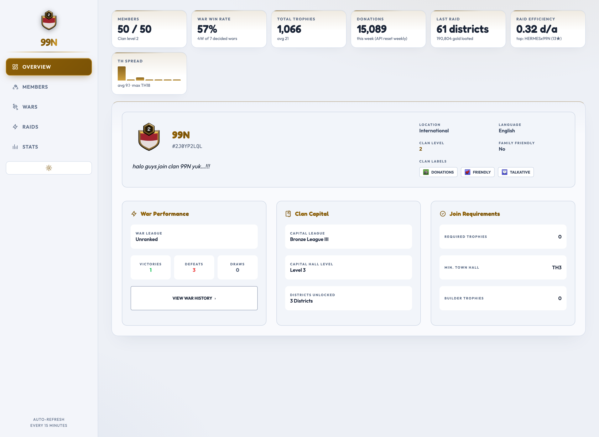
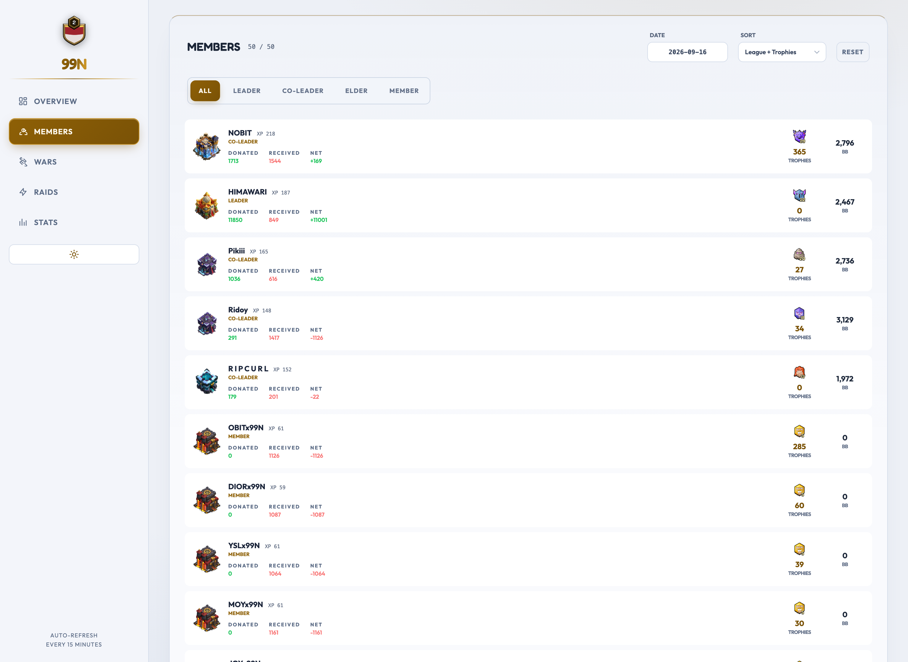
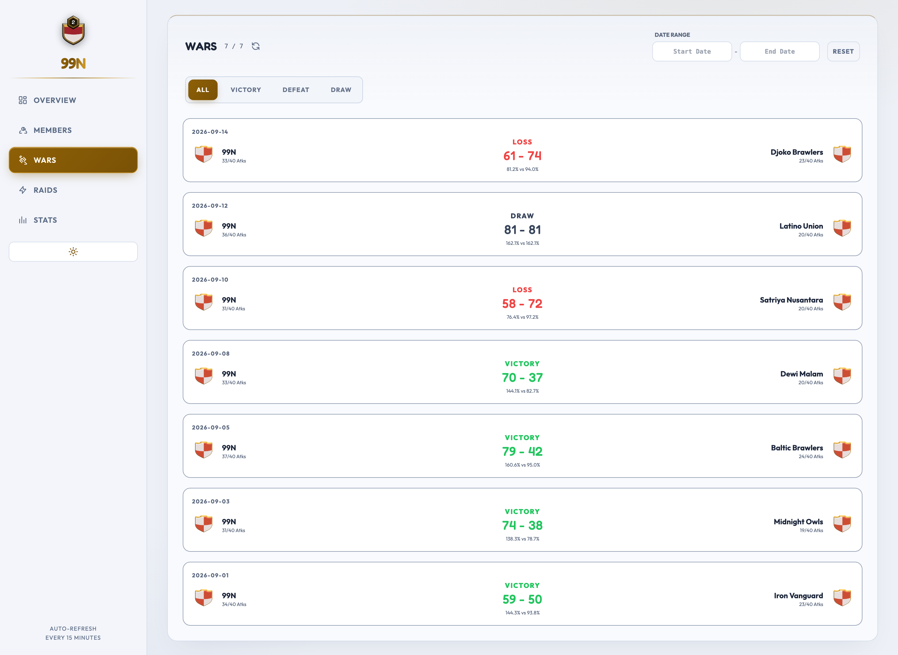
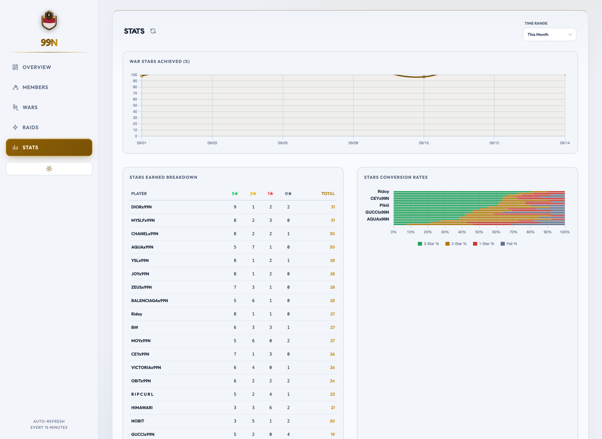

# 99N — Clan War Stats

Clash of Clans clan dashboard for **99N (#2J0YP2LQL)**. A Python scraper runs on GitHub Actions, commits JSON snapshots to this repo, and the static frontend (GitHub Pages) renders them — no backend needed.

## Tabs

| Tab | What it shows | Data source |
|---|---|---|
| Overview | KPI strip + clan card, war/capital league, join requirements, **CWL standings** | latest member snapshot + indices |
| Members | Roster with donations, trophies, role filters, **any historical date** | daily snapshots |
| Wars | War list + per-player attack/defense breakdown, win probability, cleanup needed | war snapshots |
| Raids | Capital raid weekends: attacks, defenses, loot per player | raid logs |
| Stats | Stars-trend line, top-25 star breakdown, conversion-rate bars (finished wars only), **raid attendance** | war + raid snapshots |

## Screenshots (War Room, night theme)

| Overview — KPI strip + clan card | Members — roster with Net & Builder Base |
|---|---|
|  |  |
| **Wars — history & results** | **Stats — trend & conversion** |
|  |  |

> War screenshots use a synthetic war-history fixture (the archive was empty
> when they were captured) — the real site fills from actual 99N wars.

## How it works

```
Supercell API ──(proxy)──► GitHub Actions (cron) ──► commit JSON to data/ ──► Pages serves js/ + data/
```

The browser never calls the API — it only reads committed JSON. That's why the API token lives solely in Actions secrets.

### Data layout

```
data/
  clan_stats/members_YYYYMMDD.json   + clan_stats_index.json   # daily roster
  war_stats/war_<startTime>.json     + war_stats_index.json    # live war, finalised on warEnded
  raid_stats/raid_<startTime>.json   + raid_stats_index.json   # per raid weekend
  warlog_stats/warlog.json                                      # last 50 results (no attacks)
  player_stats/players_YYYYMMDD.json + player_stats_index.json  # career stats per member
  meta.json                                                     # goldpass / country rank / CWL
  notify_state.json                                             # last-seen state for Discord alerts
```

**War history starts from the day you install this** — the CoC API only exposes full per-player attack data on the `currentwar` endpoint while a war is live; `warlog` has results but no attacks, so older wars cannot be backfilled (they still appear in the list, marked *summary only*).

### How a finished war gets its result

`currentwar` stops returning a war the moment the next one starts, so a war's
last snapshot is frozen at `state: inWar` with a **partial** score — 24 stars
where the final was 26. Scoring that frozen partial is wrong, and treating it as
undecided forever is worse: the card reads *Incomplete* long after the war is
over.

`warlog` carries the authoritative final result but no roster, and the two
endpoints stamp `endTime` **independently** — they land one to two seconds
apart for the same war (`...073745.000Z` vs `...073747.000Z`). Pairing on exact
equality therefore never matches, which is why this used to leave finished wars
permanently *Incomplete* and append the same war twice.

`mergeWarLog` in `js/warmerge.js` pairs each snapshot with the nearest warlog
entry inside a 60-second window and promotes the snapshot **in place**: final
stars, destruction and attack count from warlog, per-player roster kept. That is
why the war stops reading *Incomplete* without losing the only record of who
attacked. A war still live, or older than the 50-entry warlog window, is left
untouched — an unarchived war is never given a guessed result.

## Discord notifications

Two ways to reach the clan Discord, both driven by one secret:

```bash
# .env (local) or Settings -> Secrets -> Actions (repo)
DISCORD_WEBHOOK_URL=https://discord.com/api/webhooks/<id>/<token>
```

**Automatic** — `scrapers/notify.py` runs after each scrape and posts only on a
state *change* (state lives in `data/notify_state.json`, so restarts never spam):

| Event | Trigger | Embed |
|---|---|---|
| War preparation | new war enters `preparation` | opponent, size, battle-day time |
| War result | snapshot flips to `warEnded` | VICTORY/DEFEAT/DRAW, stars, destruction |
| Raid start / finish | raid weekend opens or closes | loot, districts, top looters |
| Roster change | a tag appears or disappears | who joined/left + new count |
| Donation week | weekly counters reset | last week's total + early leaders |

The step is `continue-on-error: true`: a missing webhook or a Discord outage
never fails the data pipeline. Test locally without sending anything:

```bash
PYTHONPATH=scrapers python3 scrapers/notify.py --event war --dry-run
```

**Manual** — send a one-off message to the clan Discord from the CLI. The
webhook URL is never stored in the repo; it lives in `.env`/Actions secrets:

```bash
PYTHONPATH=scrapers python3 scrapers/broadcast.py --text "War jam 20:00!" --title "War Reminder" --color gold
```

## Theme system

The UI ("War Room") is one palette contract with two value sets, selected by `<html data-theme="night|day">`:

- Every color is a CSS custom property in `css/style.css` (night = navy onyx + Clash gold, day = cool paper + bronze). Token *names* are stable; only values swap, so no `dark:` variants exist anywhere in the markup.
- Tailwind utilities (`text-gold`, `bg-gray-800`, even `text-white`) resolve to those vars through `tailwind.config` in `index.html`; Chart.js resolves them at draw time via `chartTheme()` in `js/charts.js` and re-renders when you toggle.
- The toggle (sidebar/top bar) persists to `localStorage.coc-theme`; a boot script in `<head>` applies the stored theme — or the OS `prefers-color-scheme` — before first paint, so there is no flash.
- Contrast is WCAG-checked per theme (≥4.5:1 for all text pairs).

**Layout**: 236px sticky sidebar ≥1024px, collapsing to a scrollable top bar on mobile. The Overview KPI strip (`renderKpis` in `js/app.js`) is derived entirely from data the app already fetched — nothing extra hits the network; the win-rate card is governed by the same `warEnded` guard as the Wars tab.

## Setup

### 1. API token

Register at [developer.clashofclans.com](https://developer.clashofclans.com) and create a key. One key = one allowed IP:

| Where scrapers run | Base URL | IP to **include** when creating the key |
|---|---|---|
| GitHub Actions | `https://cocproxy.royaleapi.dev/v1` (default) | `45.79.218.79` (the RoyaleAPI proxy) |
| Your laptop | `COC_API_BASE_URL=https://api.clashofclans.com/v1` | your own IP ([ifconfig.me](https://ifconfig.me)) |

These can be two separate keys; the proxy key is only for Actions.

### 2. GitHub secrets

Settings → Secrets and variables → Actions:

- `COC_API_TOKEN` — the proxy-whitelisted key
- `CLAN_TAG` — e.g. `#2J0YP2LQL`

### 3. Permissions & Pages

- Settings → Actions → General → Workflow permissions → **Read and write** (the bots commit back).
- Settings → Pages → Deploy from a branch → `main`, root folder. This repo is public, so Pages is free; a private repo needs GitHub Premium, or a separate public repo for the rendered site (never commit `.env` or tokens there).
- Live here: https://fthyll.github.io/99N/
- `CNAME` (optional): put your own domain there and point DNS at GitHub Pages.

Every workflow states its own token scope rather than inheriting the repo
default: the four scrapers declare `contents: write` at the job level because
they commit back, and `tests.yml` and `health.yml` declare `contents: read`.
`tests.yml` matters most — it is the only workflow triggered by
`pull_request`, so its scope is the one that would widen if the default changed.

### 4. Automation

| Workflow | Schedule | What |
|---|---|---|
| `update_war.yml` | every 15 min | live war snapshots; finalises each war once |
| `update_raid.yml` | every 15 min | current raid weekend; new file each weekend |
| `update_cwl.yml` | every 15 min | league group + standings, during a season |
| `update_clan.yml` | daily 09:00 UTC | roster snapshot for the Members history |
| `tests.yml` | on push / PR | Node + Python suites, HTML structure check |
| `health.yml` | every 2 h | alerts if snapshots or scheduled runs go stale |

Manual trigger: Actions tab → *Run workflow*.

### Local run (optional)

```bash
cd scrapers && pip install requests python-dotenv
cp ../.env.example ../.env   # fill COC_API_TOKEN, CLAN_TAG (+COC_API_BASE_URL)
PYTHONPATH=$PWD python3 ../scrapers/clan_scraper.py
```

Files land in `scrapers/data/` when run from that directory — run them from the repo root (like the workflows do) to write `data/` directly.

## Tests

No dependencies beyond Node and Python; run from the repo root:

```bash
node js/xss.test.mjs            # 27 checks: weaponised names render inert in every view
node js/warmerge.test.mjs       # 16 checks: warlog pairing, in-place promotion, no duplicates
node js/statsrange.test.mjs     # 17 checks: empty-range fallback (clock is pinned)
node js/warstate.test.mjs       # only warEnded wars get a Victory/Loss/Draw label
node js/cwl.test.mjs            # league table, out-of-season vs failed-lookup wording
node js/chartdata.test.mjs      # chart text twins are labelled, sr-only, and actually filled
node js/refresh.test.mjs        # what a refresh reports: changed, unchanged, no stamp, failure
node js/syncbtn.test.mjs        # every tab in the nav has a working refresh button
node js/importsmoke.test.mjs    # all modules parse without a DOM
node js/notifier.test.mjs       # embed shapes + state transitions
python3 scrapers/war_scraper_test.py    # 9 scenarios against a stubbed HTTP layer
python3 scrapers/watchdog_test.py      # 14 checks: thresholds, independent age checks, alerting
python3 scrapers/clan_scraper_test.py   # a failed fetch exits non-zero and writes nothing
python3 scrapers/cwl_scraper_test.py    # the 15m writer touches only the cwl key
python3 scrapers/meta_scraper_test.py   # CWL endpoint, league-table arithmetic, failure states
python3 scrapers/http_client_test.py    # retry/backoff on 429, 5xx and Cloudflare 5xx
python3 scrapers/retention_test.py      # pruning never orphans an index entry
python3 scripts/check_html.py            # index.html <div> balance + section nesting
```

The Python tests need `COC_API_TOKEN` and `CLAN_TAG` set to *any* value —
`config.py` refuses to import without them. No request is ever made.

Two suites that reason about the calendar (`statsrange`, and the unarchived-war
branch of `warstate`) pin their own clock. Without a pinned `now` they start
failing on the 1st of a month, which is exactly when the behaviour they cover
matters.

All of the above run in CI on every push and PR (`.github/workflows/tests.yml`),
plus a check that `index.html` has balanced `<div>`s and keeps every
`[id^="section-"]` a sibling. That last one is not ceremony: a missing `</div>`
once nested one section panel inside another `display:none` section, so the tab
rendered completely blank and nothing complained.

## Clan War League (Overview tab)

`scrapers/meta_scraper.py` archives the live league group into
`data/meta.json`. Two things about it are worth knowing:

**The endpoint is `/clans/{tag}/currentwar/leaguegroup`.** It used to resolve
the league tag by scanning up to five members via `/players/{tag}` (reasonable
at the time), then fetch the group from **`/cwl/{tag}` — an endpoint that does
not exist in the Clash of Clans API**. Every one of those requests 404'd, so
`cwl` has been `null` in `meta.json` since the feature landed and the panel
rendered nothing. The tag lookup is unnecessary: the clan's own
`currentwar/leaguegroup` returns the group directly.

That endpoint returns `state`, `season`, the clans in the group (name, tag, level,
badge, member town hall levels) and `rounds[].warTags` — **but no scores**. So
the league table is derived rather than read: each finished war is fetched from
`/clanwarleagues/wars/{warTag}`, settled on stars, then on destruction
percentage, then drawn. Points are `wins*3 + draws`, with stars breaking ties.

Every clan in the group gets a row, even at 0-0-0 before the first war — a
missing row reads as "not in the group". A war still live, or a war tag that
404s, leaves the table intact rather than inventing a result. Outside a season
the panel says **Not in a season** in words rather than showing zeroes, which
read as a lost season.

Note there is a second, unrelated endpoint, `/leaguegroup/{tag}/{seasonId}`,
which serves ranked battle leagues. It is not what a clan war league group
resolves to, and swapping one for the other silently returns the wrong shape.

**A null `cwl` is not a valid state.** It cannot distinguish "not in a season"
from "the lookup broke", which is precisely how the dead `/cwl/` endpoint went
unnoticed for the panel's entire life. The key is now always an object:

| `cwl` | Meaning |
|---|---|
| `{state, season, standings}` | live group, standings derived from finished wars |
| `{state: "notInSeason"}` | 404 — 99N is between seasons, which is normal |
| `{state: "unavailable", httpStatus}` | the lookup failed and there was no good table to keep |
| `{state: "inWar", …, stale: true, error}` | the lookup failed but a good table was already held — it is kept, marked stale, with the error beside it |

So an endpoint that breaks again shows a named fault with its status instead of
quietly reading as a league that never started. A held table matters in
practice: a 500 from the proxy no longer erases a live standings table, and
the panel shows the last good numbers with a visible "last refresh failed"
warning instead of a dead end. The flag clears on the next successful
refresh, which writes a fresh group without `stale`.

`scrapers/cwl_scraper.py` owns the 15-minute refresh. It replaces **only** the
`cwl` key and writes nothing else, because the daily `meta_scraper.py` puts
`goldpass` and `countryRank` in the same file — a run that rewrote the whole
document from its own older view of those keys would roll them back. Country
rank alone can walk a thousand ranking rows, and none of it moves on battle day,
which is why it stays on the daily job while the league table moves every
15 minutes.

## Raid attendance (Stats tab)

Answers two different questions, kept apart because conflating them is
misleading:

- **Attacks left unused** — took part but did not spend every attack
  (`attacks` vs `attackLimit + bonusAttackLimit`, straight from the raid payload).
- **Did not raid at all** — on the roster but absent from the raid's member
  list. The raid API only lists *participants*, so this can only be computed by
  diffing against the current roster; a member who joined after that weekend
  therefore appears here too.

Attendance is measured against the **roster size**, not the participant count:
34 of 50 raiding is 68%, even though everyone who showed up attacked fully.
That distinction is why the card can show a low attendance figure next to zero
incomplete attacks.

Absentees are split by whether the account looks dormant — **zero trophies AND
zero donations** (`isDormant` in `js/raidstats.js`). In 99N's archive all 16
non-raiding members were low-experience TH8 accounts with no activity at all,
while every active member with zero trophies still had donations. Without this
split the report reads as "16 members skipped the raid" when the truth is
"16 unused alt accounts don't raid", which blames the wrong people. Dormant
accounts are listed for completeness and are excluded from the *most weekends
missed* ranking. The heuristic only labels — it never removes anyone from a
count.

The logic lives in `js/raidstats.js` (pure functions, `js/raidstats.test.mjs`),
separate from rendering, so the counting rules are testable.

## Data retention

Snapshots are pruned by `scrapers/retention.py`, called at the end of the war
and raid scrapers. It keeps the newest `WAR_KEEP` (150, ≈2 years) and
`RAID_KEEP` (104, ≈2 years) entries and deletes the file and its index row
together, so the index can never point at a file that is gone. Override
`WAR_KEEP`/`RAID_KEEP` as env vars.

`clan_stats` is deliberately **not** pruned: its index feeds the Members tab's
history date picker, so pruning it would silently remove dates the UI offers.

## Health check

`scrapers/watchdog.py` (`.github/workflows/health.yml`, every 2 hours) exists
because every failure mode here is silent — if the token expires or Actions
stops firing, the site keeps serving the last snapshot and looks fine. It
checks two independent things and posts a Discord alert plus a red run:

- **Snapshot age** — newest commit touching `data/` is under 24 h old.
- **Run age** — the 15-minute workflows actually ran in the last 3 h.

The two limits answer different questions. Snapshot age is the one that matters
for the dashboard: `data/` goes untouched when no war is live and no raid is
running, so a quiet week looks stale while nothing is wrong. Run age is the
faster signal that the scheduler itself has stopped.

**The run-age limit of 12 h clears the repo's normal scheduler gap.** Measured
over 100 war and 100 raid runs: the median gap was 3.8 h (war) and 4.4 h
(raid), and the worst ever observed was 8.1 h. The 12 h threshold leaves
~50% headroom above that worst case while still catching a full stop within
half a day.

The two checks answer different questions and are intentionally independent:

- **Run age** (12 h) — the 15-minute workflows actually executed. This is the
  faster liveness signal: a scheduler that has stopped entirely trips it
  within half a day.
- **Snapshot age** (24 h) — the newest commit touching `data/` is recent.
  This is the one that matters for the dashboard: `data/` goes untouched
  when no war is live and no raid is running, so a quiet week looks stale
  while nothing is wrong.

A red run is meaningful; it is no longer the expected normal state of the
repo.

Snapshot age keeps a 24 h limit for the same reason: an 11 h gap between
data commits has been observed in a quiet window, and the daily clan
snapshot is the only regular writer then.

They fail differently (a run can succeed while writing nothing), so both are
checked. Run it locally:

```bash
PYTHONPATH=scrapers GITHUB_REPOSITORY=fthyll/99N python3 scrapers/watchdog.py
```

## Adding a scraper

1. `import http_client` and call `http_client.get(url, HEADERS)` — never
   `requests.get` directly. The raw call had no retry, so a single 429 threw
   away that period's snapshot permanently (the next run only fetches the
   *current* war). 403 and 404 are returned immediately on purpose.
2. Write the snapshot, then update its index (oldest first — `app.js`
   `.reverse()`s it).
3. If the archive grows without bound, call `retention.prune(...)` **after**
   the write so the new snapshot is never the one pruned.
4. Add a `scrapers/<name>_test.py` with a `main()` returning 0/1 — CI globs
   `scrapers/*_test.py` and fails on a non-zero exit.

## Win probability — what it actually is

`calculateWinProbability` in `js/render.js` projects the remaining attacks of both sides from each attacker's month-to-date star average, with town-hall gap caps (4+ TH levels below target ≈ 1–2 stars max), a defense-insurance bonus when ahead, and volatility that grows as attacks run out. It uses finished wars only for the MTD input. Treat it as a weighted heuristic, not a calibrated model — no backtest exists.

## Stats — why the three bottom panels can go blank

The Stats tab filters war history by calendar range. On the 1st of a month the
default *This Month* range can contain **no finished wars at all** — October
opened on a war that began in September — and the three panels fed from that
same slice (*War Stars Achieved*, *Stars Earned Breakdown*, *Stars Conversion
Rates*) rendered empty with no explanation, which read as a broken dashboard
rather than an empty calendar.

`resolveStatsRange()` in `js/statsrange.js` resolves the range before the charts
draw, falling back `month → week → previous month` until it finds decided wars,
and only then renders. The label under the range selector says which range is
actually in use and why it fell back (`This Week — no wars in this month`), so a
fallback is legible instead of silent.

Changing the default range to *This Week* would also have stopped the blank
panels, but it hides the real state of the data rather than reporting it.

## Scrapers must fail loudly

Every scraper raises `SystemExit` on an unexpected API status, so the workflow
goes red instead of reporting success while writing nothing. `clan_scraper.py`
used to `print` and return 0 — the one job that still writes in a quiet window,
so a dead token produced a passing run and no snapshot, and the first hint was
the 24-hour watchdog, a day later.

The other half is not overwriting good data with a bad fetch: a failed run
leaves the previous snapshot and the index untouched.

## Charts have a text twin

Both Stats canvases (`starsTrendChart`, `efficiencyChart`) are pictures. A
screen reader sees nothing, and a screenshot posted into the clan Discord loses
the graph entirely — which is how this dashboard is actually shared mid-war.

So `paintChartData()` in `js/charts.js` writes the same numbers into an
`sr-only` `<table>` beside each canvas, and each canvas carries `role="img"`
with an `aria-label`. `.sr-only` clips rather than `display:none`, so the tables
stay in the accessibility tree and take no layout space (1×1 px, verified in a
real browser). Copying a chart's numbers now works from the page, not just by
reading pixels.

The tradeoff: these are the numbers *as displayed*, rounded to one decimal. The
tables follow the charts rather than exposing raw attack data.

## The refresh button says what it did

The refresh buttons already existed on four tabs and re-fetch everything with
cache-busting. What they did not do was say anything — and on a stale dashboard
that silence is misleading, because re-downloading identical files cannot change
anything. It reads as a broken button when the truth is that the fix is never on
the page.

So `js/refresh.js` compares the newest sync heartbeat against what this tab was
already showing and reports one of four outcomes in the freshness chip:

| Outcome | Message |
|---|---|
| newer stamp | *Updated — the scrapers committed new data since the last check.* |
| same stamp | *No change — the last scraper commit was Nh ago. Nothing on this page can update until one lands.* |
| no heartbeat | *No sync heartbeat found, so there is nothing to compare against.* |
| load threw | *Refresh failed to load — the committed data could not be read.* |

The buttons themselves were originally on three of the five tabs, so landing on
Overview — the default view — showed nothing to press. All five now carry one, and
`js/syncbtn.test.mjs` holds that as an invariant: it reads the tab list out of the
nav and fails if any tab lacks a button, so a sixth tab cannot quietly reintroduce
the hole. Overview's button lives inside the `renderAbout` template, since that
section is rendered from JS rather than written into `index.html`.

The heartbeat stamp is the honest signal: the workflows write it only when real
data changed, so it cannot advance without a commit. The first load is not
reported as an update — there is nothing to compare against, and claiming one
would be a lie that fires on every fresh page load.

The chip is `aria-live="polite"`, so the message is announced rather than only
drawn. It hides itself after 9 s, so it can never be mistaken for the sync state
shown beside it.

## Retries

`scrapers/http_client.py` retries 429, 500, 502, 503 and 504 with short
exponential backoff (3 attempts, 2s then 5s). It now also retries **521, 522,
524 and 525** — Cloudflare's "upstream unreachable" and "SSL handshake failed"
codes, which the proxy in front of the CoC API throws when a runner's TLS
session drops mid-run.

That mattered: one real run lost a full day of war snapshots to a single 525,
and it was unrecoverable. `/currentwar` only reports the current war, so the
next run had nothing to re-fetch and the day was simply gone. A retried 5xx is
cheap; a dropped day is not.
